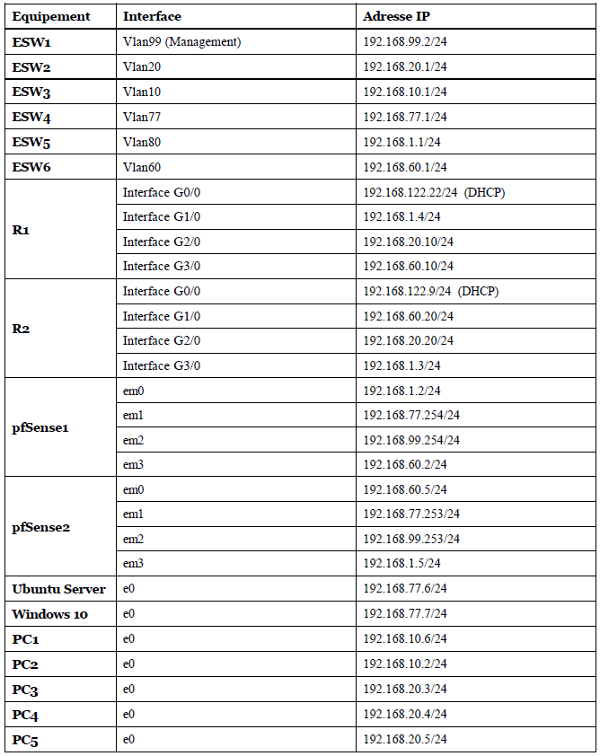
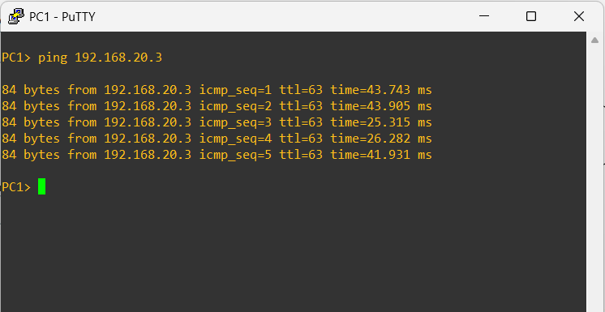
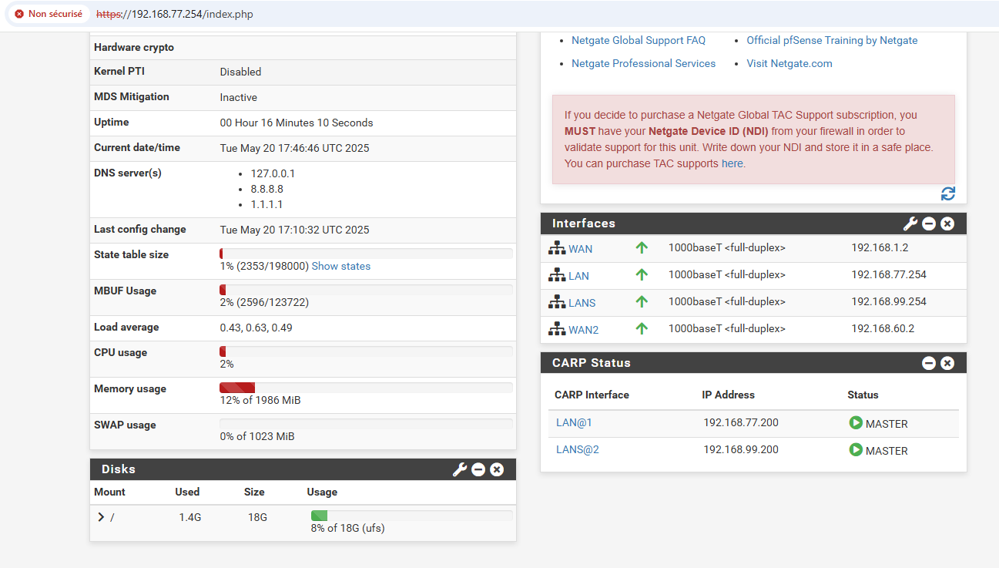
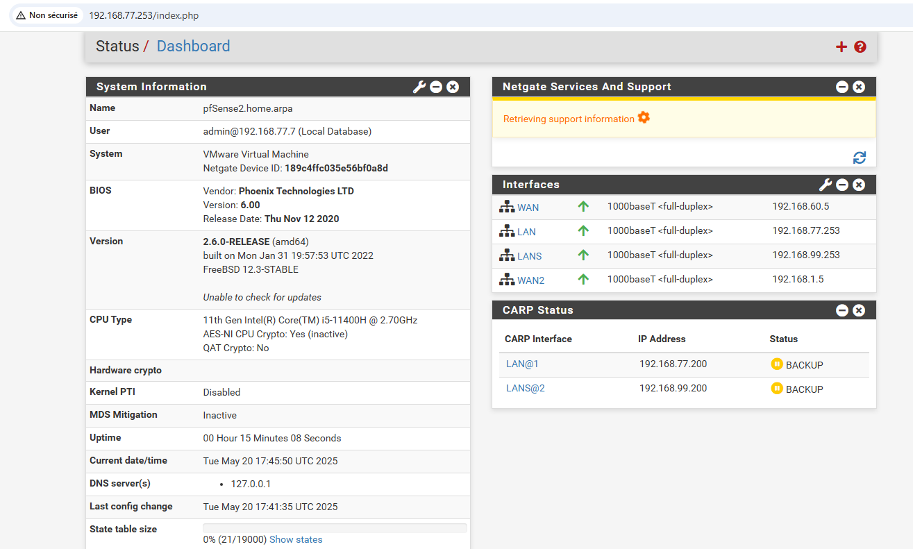
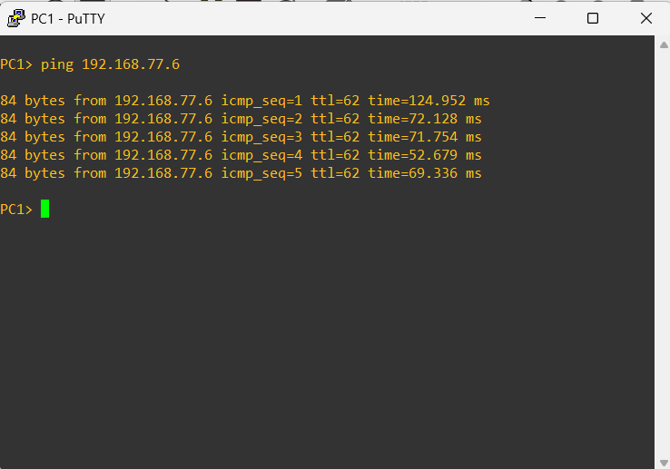
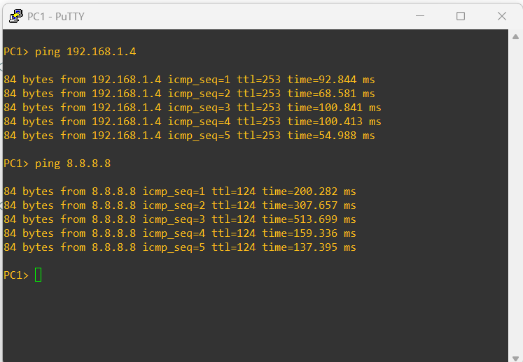
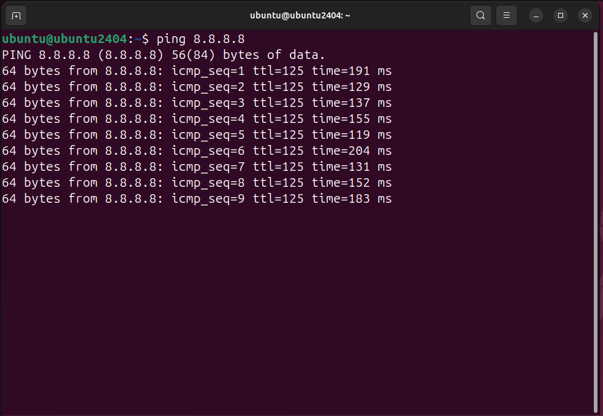

## 🌐 Déploiement de l'infrastructure réseau

Nous avons mis en œuvre l’infrastructure réseau cible basée sur l’architecture définie en phase de conception, avec des VLANs, des routeurs, des commutateurs et des pare-feux **pfSense** en haute disponibilité (HA).  
pfSense est utilisé pour le contrôle central des flux réseau, le filtrage, l’application des politiques d’accès et la prévention d’intrusions (IDS/IPS).

📸 Architecture

  
*Figure 1 : Architecture réseau cible*

### 📊 Plan d'adressage

*Figure 2 : Répartition des sous-réseaux et IP*

Tests réalisés pour vérifier la communication entre VLANs et l’accès Internet.

*Figure 3 : PC1 vers PC3*

*Figure 4 : PC4 vers PC2*

### 🔐 Haute disponibilité (HA)

 *Figure 5 : pfSense1 → Master* 

 

*Figure 6 : pfSense2 → Backup *

### 🌐 Connectivité vers serveurs et Internet

 

*Figure 7 : PC1 vers Ubuntu Server*

 

*Figure 8 : PC1 vers Internet*  

 *Figure 9 : PC3 vers Internet*

 

*Figure 10 : Ubuntu Server vers Internet*

