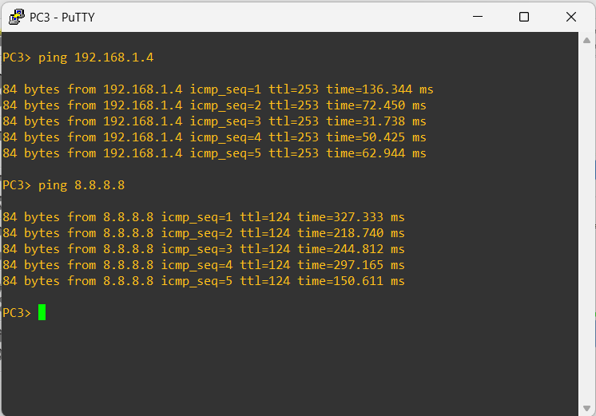

### 🌐 Déploiement de l'infrastructure réseau

Nous avons mis en œuvre l’infrastructure réseau cible basée sur l’architecture définie en phase de conception, avec des VLANs, des routeurs, des commutateurs et des pare-feux **pfSense** en haute disponibilité (HA).  
pfSense est utilisé pour le contrôle central des flux réseau, le filtrage, l’application des politiques d’accès et la prévention d’intrusions (IDS/IPS).

---

### 📸 Architecture

Cette figure illustre l’architecture réseau cible mise en place dans notre environnement.

  
*Figure 1 : Architecture réseau cible*

---

### 📊 Plan d'adressage

Cette figure présente la répartition des sous-réseaux et l’affectation des adresses IP au sein de l’architecture.

  
*Figure 2 : Répartition des sous-réseaux et IP*

---

### 🔌 Validation de connectivité

Cette section présente les tests de connectivité réalisés afin de valider l’accès aux ressources internes et externes.

Cette figure montre le test de connectivité entre PC1 et PC3, confirmant le bon fonctionnement de la communication inter-VLAN.

  
*Figure 3 : PC1 vers PC3*

Cette figure illustre le test de connectivité entre PC4 et PC2, validant la configuration réseau mise en place.

  
*Figure 4 : PC4 vers PC2*

---

### 🔐 Haute disponibilité (HA)

Cette figure présente le statut du pare-feu pfSense1 configuré en tant que nœud principal (Master) dans la solution de haute disponibilité.

  
*Figure 5 : pfSense1 → Master*

Cette figure montre le pare-feu pfSense2 configuré en tant que nœud secondaire (Backup) dans la configuration HA.

  
*Figure 6 : pfSense2 → Backup*

---

### 🌐 Connectivité vers serveurs et Internet

Cette figure illustre la connectivité entre PC1 et le serveur Ubuntu, confirmant l’accessibilité entre les VLANs.

  
*Figure 7 : PC1 vers Ubuntu Server*

Cette figure montre la réussite de la connexion de PC1 vers Internet.

  
*Figure 8 : PC1 vers Internet*

Cette figure illustre l’accès à Internet depuis PC3, validant la configuration réseau pour le VLAN 20.

  
*Figure 9 : PC3 vers Internet*

Cette figure présente la connectivité du serveur Ubuntu vers Internet, confirmant le bon fonctionnement de la passerelle réseau.

  
*Figure 10 : Ubuntu Server vers Internet*
