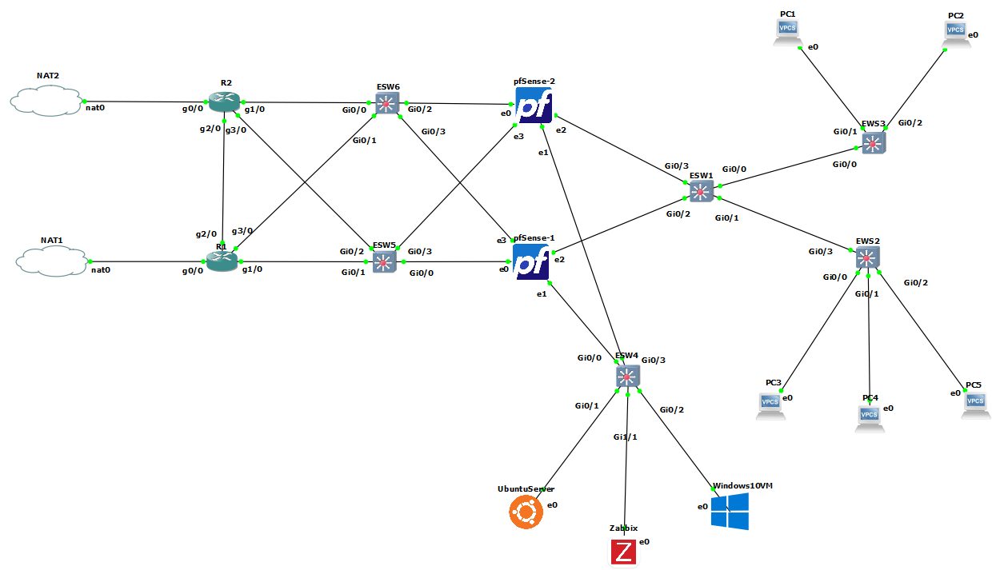
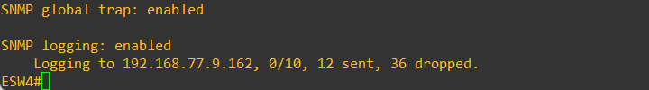
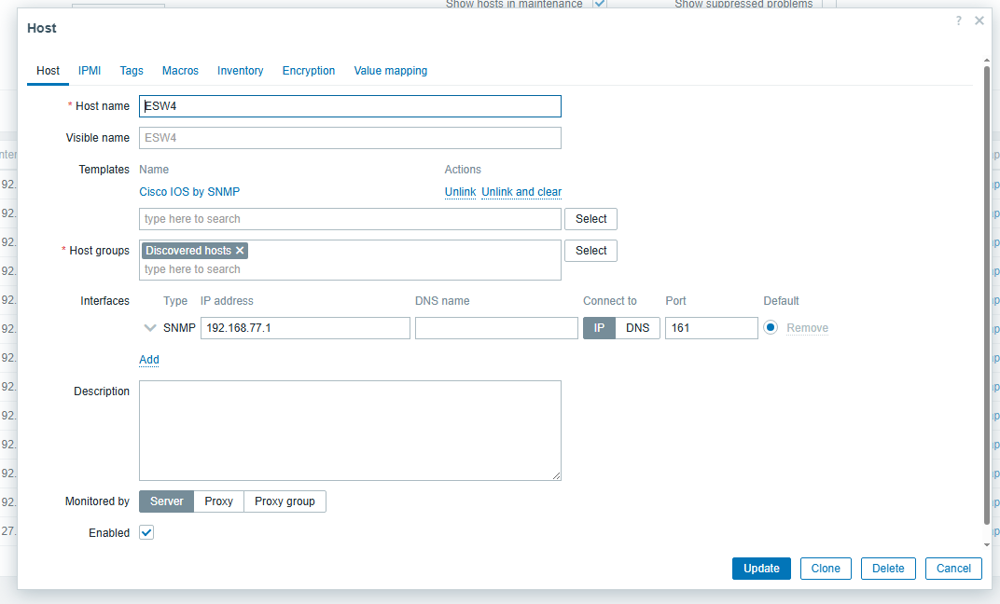

## 📡 Network Monitoring avec Zabbix

Dans cette partie, nous avons intégré **Zabbix** au sein de notre architecture réseau afin d’assurer une supervision centralisée, en temps réel, des différents équipements. Cette solution permet de détecter rapidement les anomalies, d’anticiper les pannes et d’améliorer la disponibilité ainsi que la sécurité globale de l’infrastructure.

---

### 🏗️ Intégration de Zabbix

Cette figure illustre l’intégration du serveur Zabbix dans l’architecture réseau.

  
*Figure 1 : Intégration du serveur Zabbix dans l’architecture réseau*

---

### 🔌 Supervision des commutateurs

Après la configuration du protocole SNMP sur le commutateur ESW4, nous avons vérifié l’état du service afin de valider son bon fonctionnement.

  
*Figure 2 : État du protocole SNMP sur le commutateur*

Le commutateur a ensuite été ajouté au serveur Zabbix pour assurer sa supervision.

  
*Figure 3 : Ajout du commutateur au serveur Zabbix*

Les figures suivantes illustrent la supervision des commutateurs via SNMP dans Zabbix.

  
*Figure 4 : Surveillance des commutateurs ESW1, ESW2, ESW3*

  
*Figure 5 : Surveillance des commutateurs ESW4, ESW5, ESW6*

Les figures ci-dessous présentent la surveillance du trafic des interfaces du commutateur ESW4.

  
*Figure 6 : Interfaces Gi0/0 et Gi0/1*

  
*Figure 7 : Interfaces Gi0/2 et Gi0/3*

---

### 🌐 Supervision des routeurs

Le protocole SNMP a été configuré sur le routeur R1 afin de permettre l’envoi de traps vers Zabbix.

  
*Figure 8 : État du service SNMP sur le routeur*

Le routeur a ensuite été intégré dans Zabbix pour assurer sa supervision.

  
*Figure 9 : Ajout du routeur au serveur Zabbix*

Cette figure montre la supervision des routeurs via SNMP.

  
*Figure 10 : Surveillance des routeurs R1 et R2*

---

### 🔐 Supervision des pare-feux

Les pare-feux **pfSense** ont été configurés pour la supervision SNMP avec Zabbix, permettant la collecte des métriques et la réception des traps.

  
*Figure 11 : Configuration SNMP de pfSense1*

  
*Figure 12 : Configuration SNMP de pfSense2*

Les pare-feux ont ensuite été ajoutés à Zabbix.

  
*Figure 13 : Ajout de pfSense1*

  
*Figure 14 : Ajout de pfSense2*

Cette figure illustre la supervision active des pare-feux.

  
*Figure 15 : Surveillance des pare-feux*

---

### 💻 Supervision des machines virtuelles

Les machines **Ubuntu Server** et **Windows 10** ont été supervisées via le déploiement de l’agent Zabbix.

#### 🐧 Ubuntu Server

  
*Figure 16 : État de l’agent Zabbix sur Ubuntu*

  
*Figure 17 : Intégration de l’agent avec le serveur*

  
*Figure 18 : Ajout de la VM Ubuntu*

  
*Figure 19 : Supervision du serveur Ubuntu*

---

#### 🪟 Windows 10

  
*Figure 20 : Configuration de l’agent Zabbix sur Windows*

  
*Figure 21 : Ajout de la VM Windows*

  
*Figure 22 : Supervision du système Windows*
