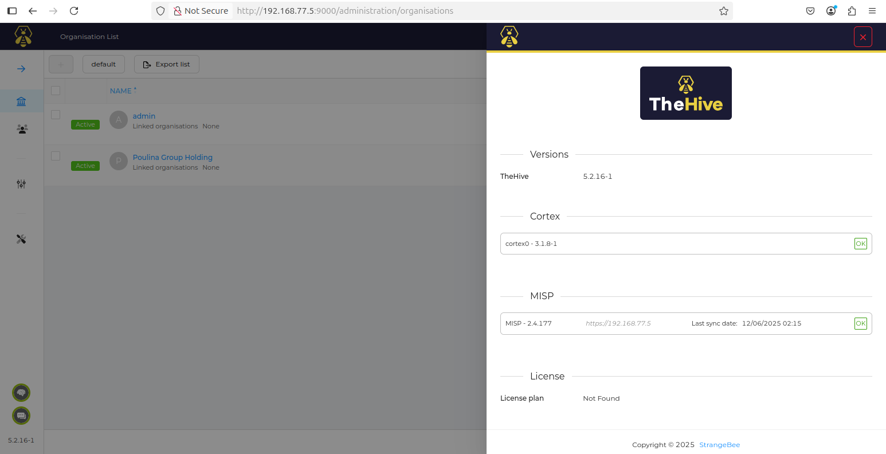

Designed and implemented an automated Security Operations Center (SOC) platform leveraging SIEM and SOAR for real-time threat detection and incident response. Developed a secure network architecture featuring VLAN segmentation, advanced routing, high-availability firewalls, and centralized performance monitoring to ensure optimal system and network efficiency.

Tools and Technologies Used:

Wazuh (SIEM): Collects, correlates, and analyzes logs and security events to detect threats in real time.

SOAR / Incident Response:

TheHive: Centralized incident management platform to track, analyze, and effectively resolve security alerts.

Cortex: Automates the analysis of Indicators of Compromise (IOCs) and enriches information from security alerts.

MISP: Threat intelligence platform that enables integration and sharing of information on attacks and malicious campaigns.

(These three tools work together in an integrated way to automate the collection, analysis, and response to incidents.)

Zabbix (Performance Monitoring): Centralized monitoring of systems and networks to ensure optimal availability and performance.

  
*Figure 1 : Architecture réseau cible*

# SOC/SOAR – Supervision et Orchestration de la Sécurité

  
*Vue globale de l’intégration MISP, Cortex et TheHive*

Ce projet présente la mise en place complète d’une **architecture SOC/SOAR** (Security Operations Center & Security Orchestration, Automation and Response), intégrant la supervision, l’analyse et l’automatisation des réponses aux incidents de sécurité.

Il combine plusieurs outils professionnels : **Wazuh**, **TheHive**, **Cortex**, et **MISP**, afin de collecter les logs, détecter les incidents, corréler les événements et automatiser les réponses.

---

## 🎯 Objectifs du projet

- Superviser en temps réel les systèmes et réseaux via **Wazuh**  
- Automatiser le traitement des alertes avec **TheHive** et **Cortex**  
- Corréler les événements de sécurité et enrichir les analyses avec **MISP**  
- Valider le SOC/SOAR avec des scénarios réalistes : attaques par force brute, fichiers malveillants, etc.  

---

## 🛠 Technologies utilisées

| Technologie | Rôle |
|------------|------|
| **Wazuh** | SIEM et supervision des endpoints |
| **TheHive** | Gestion des incidents et des cas de sécurité |
| **Cortex** | Analyse des artefacts et observables |
| **MISP** | Gestion et partage d’indicateurs de compromission (IOCs) |
| **Docker / Docker Compose** | Déploiement rapide des services |
| **Ubuntu Server & Windows 10** | Environnements cibles pour tests |
| **Kali Linux** | Machine d’attaque pour simulations |

---

## 🏗 Architecture du projet

  
*Intégration de Kali Linux dans la maquette pour tests*

```text
VLAN 10      VLAN 77
PC1/Kali ---> Ubuntu Server (Wazuh Agent)
                |
                v
             Wazuh Server
                |
       ---------------------
       |                   |
   TheHive                Cortex
       |                   |
      MISP (IOC) <---------
