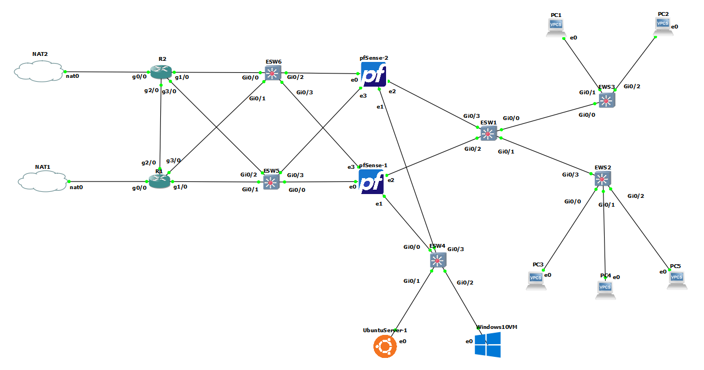
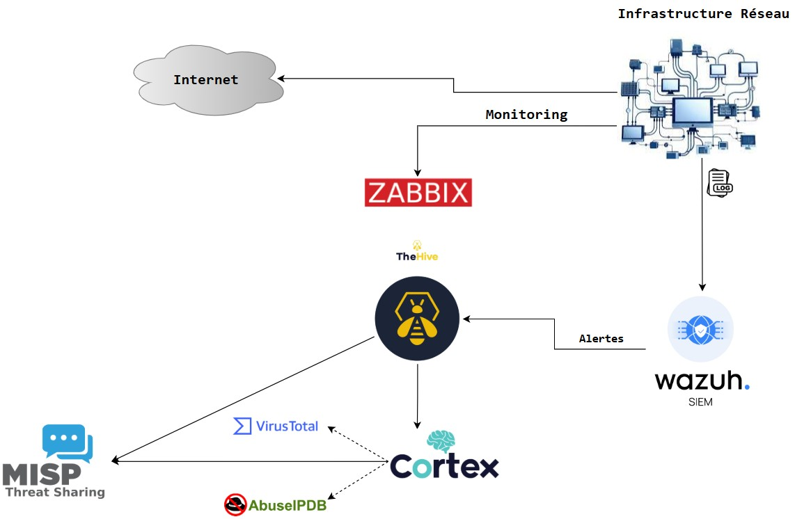
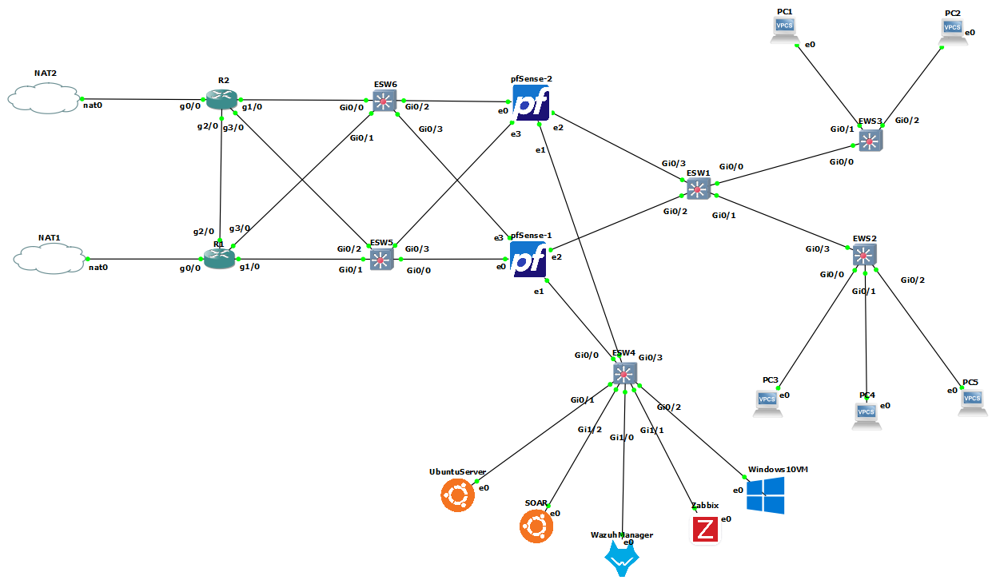

# 🛡️ Conception et mise en place d'une plateforme de SOC automatisée

Ce projet illustre la conception, le déploiement et la supervision d’une **infrastructure réseau sécurisée** intégrant une solution **SOC (Security Operations Center)** complète.  
Il couvre la configuration des équipements réseau, l’intégration des outils de cybersécurité, la collecte et l’analyse des événements, ainsi que la gestion automatisée des incidents.

---

## 📌 Objectifs du projet

- Déployer une **architecture réseau segmentée** avec VLAN, routage sécurisé et isolation des flux critiques.  
- Implémenter une **solution SOC complète** pour la corrélation, la centralisation et l’analyse des événements de sécurité.  
- Automatiser la **gestion des alertes et la réponse aux incidents** via des outils comme **Wazuh**, **TheHive**, **Cortex** et **MISP**.  
- Tester la résilience et la détection face à des scénarios d’attaque réalistes (force brute, fichiers malveillants, compromission de endpoints).

---

## 🏗️ Architecture du projet

### 1. Architecture réseau cible
Représente le réseau opérationnel avant l’intégration des outils SOC.  
La configuration comprend VLAN, sous-réseaux, liaisons inter-switches, interconnexion des routeurs et la mise en place de pare-feux périmétriques **pfSense**.  
Ces derniers assurent une sécurisation robuste du trafic réseau, le filtrage des accès, la journalisation centralisée et la protection contre les menaces externes.  
L’ensemble de l’architecture est entièrement provisionné et opérationnel.

  
*Architecture réseau cible, entièrement*

### 2. Architecture SOC
Solution SOC déployée pour superviser le réseau, détecter les incidents et orchestrer la réponse automatisée.  
Inclut la collecte des logs, l’analyse des événements et la corrélation avec des référentiels comme **MITRE ATT&CK**.

  
*Architecture SOC intégrée et opérationnelle*

### 3. Architecture réseau avec SOC
Illustration du réseau cible enrichi par l’intégration des composants SOC, mettant en évidence les flux d’information et l’emplacement des agents et serveurs de sécurité.

  
*Architecture réseau avec intégration des outils SOC*

---

## 🛠️ Outils et technologies

- **Wazuh** : SIEM et détection d’intrusions, collecte et corrélation des événements de sécurité  
- **TheHive** : plateforme SOAR pour la gestion centralisée des incidents, orchestration et automatisation des workflows de réponse  
- **Cortex** : analyse automatisée des observables et enrichissement des incidents grâce à l’intégration avec des sources externes  
- **MISP** : plateforme de Threat Intelligence pour le partage de renseignements sur les menaces et l’enrichissement des incidents dans le SOC  
- **Zabbix** : supervision et monitoring des systèmes et applications, collecte d’indicateurs de performance et d’événements critiques  
- **VirusTotal** : service d’analyse de fichiers et d’URL pour détecter les malwares et identifier les indicateurs de compromission  
- **AbuseIPDB** : base de données publique de réputation d’IP pour vérifier et enrichir les alertes liées aux adresses IP malveillantes  

---

## 🧪 Scénarios de tests et validation

Les tests réalisés valident la capacité du SOC à détecter, remonter et orchestrer la réponse aux incidents.

### Scénario 1 : Attaque par force brute
- Simulation d’attaques SSH sur un serveur Ubuntu avec **Kali Linux** et **Hydra**.  
- Détection des tentatives d’intrusion et génération d’alertes dans **Wazuh**.  
- Transmission et analyse automatisée des alertes via **TheHive** et **Cortex**.

### Scénario 2 : Injection de fichier malveillant
- Téléchargement d’un fichier **Trojan** sur le serveur Ubuntu.  
- Détection d’altération de fichiers via **Wazuh FIM** et génération d’alertes critiques.  
- Enrichissement et analyse des informations dans **TheHive** et **Cortex**.

Ces tests démontrent l’efficacité du SOC pour la **supervision proactive**, la **détection avancée** et la **réponse automatisée aux incidents**.

---

## 📂 Organisation des fichiers

- `README.md` : documentation principale du projet, présentant l’architecture, les objectifs et l’organisation générale.  
- `Network/` : dossier relatif à la partie réseau.  
- `Network_configuration.md` : documentation détaillée de la configuration réseau, incluant VLAN, sous-réseaux, routeurs, switches et pare-feux.  
- `Network_monitoring.md` : supervision réseau, outils et méthodologies de monitoring pour assurer la disponibilité et la sécurité.  
- `SOC/` : dossier dédié à la partie SOC.  
- `SIEM.md` : configuration et déploiement de la supervision SIEM avec Wazuh, collecte et corrélation des événements de sécurité.  
- `SOAR.md` : déploiement et utilisation des outils TheHive, Cortex et MISP pour l’orchestration, l’automatisation et la réponse aux incidents de sécurité.  
- `Test.md` : description des scénarios de tests, simulations d’attaques et validation de l’efficacité des solutions SOC.  
- `images/` : captures d’écran, schémas d’architecture et illustrations pour documentation et reporting.
- `docker-compose.yml` : fichier de déploiement Docker orchestrant les conteneurs pour TheHive, Cortex et MISP
  

