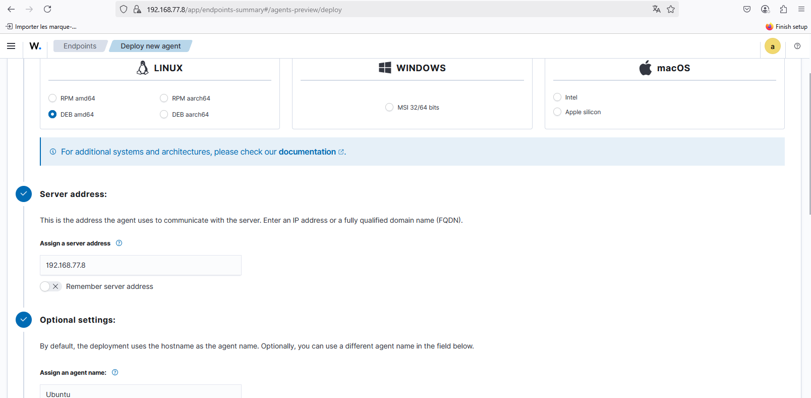
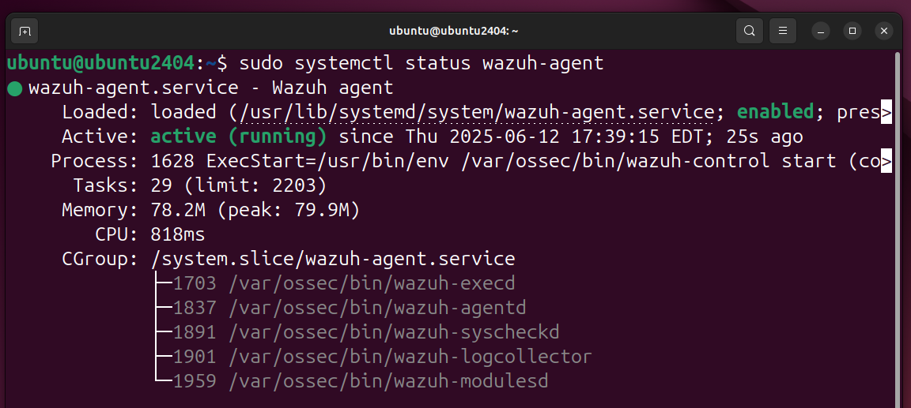
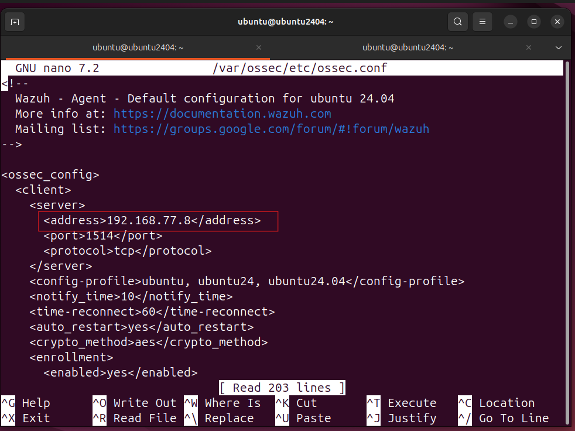

# 📊 Supervision SIEM avec Wazuh

Cette section présente l’intégration de **Wazuh** dans notre architecture réseau afin de collecter, centraliser et analyser les journaux d’activité et événements de sécurité. Cette solution permet une supervision en temps réel des systèmes et des pare-feux, ainsi qu’une corrélation avec les techniques MITRE ATT&CK.

---

## 🛠️ Déploiement des agents Wazuh

Les agents Wazuh ont été déployés sur deux machines virtuelles : **Ubuntu Server** et **Windows 10**, afin d’assurer la collecte et la remontée des logs vers le serveur principal.

### 🐧 Ubuntu Server

1. **Enregistrement de l’hôte sur le serveur Wazuh**
   
   Cette étape permet de générer les clés d’authentification pour établir une communication sécurisée entre l’agent et le serveur.
   La figure ci-dessous montre l’ajout de l’agent Ubuntu depuis l’interface d’administration.
   
     
   *Figure 1 : Ajout de l’agent Ubuntu sur le serveur Wazuh*

3. **Installation et vérification de l’agent**

   Après installation, l’agent est lancé et son état est vérifié pour s’assurer qu’il fonctionne correctement.  
   La figure suivante illustre l’état du Wazuh Agent sur Ubuntu Server.
   
     
   *Figure 2 : État du Wazuh Agent sur Ubuntu Server*

5. **Configuration de l’agent**
   
   L’adresse IP du serveur Wazuh est ajoutée dans le fichier de configuration de l’agent pour établir la connexion sécurisée.  
   La figure ci-dessous présente cette configuration.  
     
   *Figure 3 : Configuration du Wazuh Agent sur Ubuntu*

---

### 🪟 Windows 10

1. **Enregistrement de l’hôte sur le serveur Wazuh**  
   La machine Windows est enregistrée sur le serveur pour générer les clés d’authentification sécurisées.  
   La figure suivante montre l’ajout de l’agent Windows sur le serveur Wazuh.  
     
   *Figure 4 : Ajout de l’agent Windows sur le serveur Wazuh*

2. **Installation et vérification de l’agent**  
   Après installation, l’état de l’agent est vérifié pour confirmer sa communication avec le serveur.  
   La figure ci-dessous illustre l’état du Wazuh Agent sur Windows 10.  
     
   *Figure 5 : État du Wazuh Agent sur Windows 10*

---

### 📋 Liste des agents

Le serveur Wazuh affiche la liste des agents enregistrés, confirmant que tous communiquent activement avec le serveur.  
La figure suivante présente cette liste d’agents actifs.  
  
*Figure 6 : Agents Wazuh actifs sur le serveur*

---

### 📈 Collecte des journaux

#### Windows 10
Le serveur Wazuh intercepte les logs et alertes générés par l’agent Windows.  
La figure ci-dessous montre les journaux collectés depuis Windows 10.  
  
*Figure 7 : Journaux et alertes collectés depuis Windows 10*

#### Ubuntu Server
Le serveur Wazuh intercepte également les logs et alertes générés par l’agent Ubuntu.  
La figure suivante illustre ces journaux.  
  
*Figure 8 : Journaux et alertes collectés depuis Ubuntu Server*

---

### 🛡️ Analyse MITRE ATT&CK

#### Windows 10
Les activités observées sur la machine Windows sont corrélées avec les techniques MITRE ATT&CK.  
La figure ci-dessous illustre cette corrélation.  
  
*Figure 9 : Techniques MITRE ATT&CK pour Windows 10*

#### Ubuntu Server
Les activités observées sur la machine Ubuntu sont également analysées selon MITRE ATT&CK.  
La figure suivante montre cette analyse.  
  
*Figure 10 : Techniques MITRE ATT&CK pour Ubuntu Server*

---

## 🔐 Surveillance des pare-feux pfSense

Pour superviser les pare-feux via Wazuh, il est nécessaire d’activer la **journalisation distante (Remote Logging)**, en indiquant l’adresse IP du serveur Wazuh et le port UDP 514.

### pfSense1

1. **Configuration du Syslog**  
   La figure ci-dessous montre l’activation de la journalisation distante sur pfSense1.  
     
   *Figure 11 : Activation de la journalisation distante sur pfSense1*

2. **Surveillance via Wazuh**  
   La figure suivante illustre la surveillance effective de pfSense1 depuis le serveur Wazuh.  
     
   *Figure 12 : Supervision effective de pfSense1 via Wazuh*

### pfSense2

1. **Configuration du Syslog**  
   La figure ci-dessous montre l’activation de la journalisation distante sur pfSense2.  
     
   *Figure 13 : Activation de la journalisation distante sur pfSense2*

2. **Surveillance via Wazuh**  
   La figure suivante illustre la surveillance effective de pfSense2 depuis le serveur Wazuh.  
     
   *Figure 14 : Supervision effective de pfSense2 via Wazuh*

---

Ce document fournit une vue complète de la **supervision SIEM** avec Wazuh, incluant le déploiement des agents, la collecte des logs, l’analyse MITRE ATT&CK et la surveillance des pare-feux pfSense.
