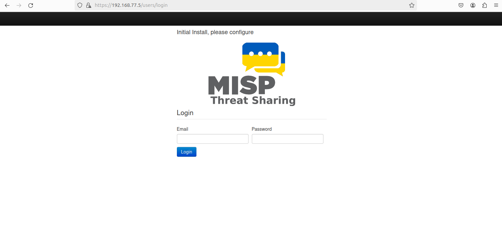

# 🤖 Orchestration et Automatisation SOAR

Ce document présente la mise en place d’une solution **SOAR (Security Orchestration, Automation and Response)** basée sur les plateformes **MISP**, **Cortex** et **TheHive**. Cette solution permet d’automatiser le traitement des incidents de sécurité, d’améliorer la corrélation des événements et d’optimiser la réponse aux menaces.

L’ensemble des composants a été déployé sur un serveur **Ubuntu**, intégré à l’architecture réseau au niveau du **VLAN 77**.

🔗 Documentation officielle :  
- https://www.misp-project.org/  
- https://docs.thehive-project.org/  
- https://docs.strangebee.com/cortex/

---

## 🧩 Déploiement de MISP

Pour la mise en place de la plateforme MISP, un fichier **Docker Compose** a été utilisé afin de déployer une architecture multi-services.

Les conteneurs ont été lancés via la commande `docker compose up`, permettant un déploiement en arrière-plan.

La figure suivante montre l’interface graphique de MISP accessible via un navigateur web, confirmant le bon fonctionnement du service.  

  
*Figure 1 : Interface graphique de MISP*

Un utilisateur administrateur a ensuite été créé afin de gérer la plateforme.  
La figure suivante illustre cette étape.  
  
*Figure 2 : Création d’un utilisateur au niveau de MISP*

---

## ⚙️ Déploiement de Cortex

Le conteneur **Cortex** ainsi que son moteur **Elasticsearch** ont été intégrés dans Docker Compose afin d’assurer un déploiement cohérent.

La figure suivante montre l’interface graphique de Cortex accessible via le port 9001.  
  
*Figure 3 : Interface graphique de Cortex*

Un utilisateur a ensuite été configuré avec les permissions nécessaires.  
La figure suivante présente cette configuration.  
  
*Figure 4 : Création d’un utilisateur au niveau de Cortex*

---

## 🔗 Intégration de Cortex et MISP

MISP a été configuré comme analyseur principal pour les indicateurs de compromission (IOCs).

L’intégration a été réalisée en configurant l’URL du serveur MISP ainsi que la clé API dans Cortex, permettant une communication sécurisée.  
La figure suivante illustre cette intégration.  
  
*Figure 5 : Intégration de Cortex et MISP*

---

## 🌐 Intégration des analyseurs

### VirusTotal

VirusTotal permet d’analyser des fichiers et des URL à l’aide de plusieurs moteurs antivirus.

La figure suivante montre l’ajout de cet analyseur dans Cortex.  
  
*Figure 6 : Ajout de l’analyseur VirusTotal*

---

### AbuseIPDB

AbuseIPDB permet de vérifier la réputation d’une adresse IP et de détecter les activités malveillantes.

La figure suivante présente son intégration dans Cortex.  
  
*Figure 7 : Ajout de l’analyseur AbuseIPDB*

---

### 🧪 Test des analyseurs

Après l’intégration des analyseurs, un test a été réalisé afin de valider leur bon fonctionnement.

Les résultats ont été correctement enregistrés dans l’historique des tâches de Cortex.  
La figure suivante illustre ces résultats.  
  
*Figure 8 : Test des analyseurs dans Cortex*

---

## 🐝 Déploiement de TheHive

La plateforme **TheHive** a été déployée via Docker Compose avec ses services associés.

La figure suivante montre l’interface Web accessible via le port 9000.  
  
*Figure 9 : Interface graphique de TheHive*

Un compte administrateur a été créé pour gérer l’organisation.  
La figure suivante illustre cette étape.  
  
*Figure 10 : Création d’un utilisateur au niveau de TheHive*

---

## 🔗 Intégration de TheHive avec Cortex et MISP

L’intégration avec Cortex a été réalisée en configurant les paramètres nécessaires (clé API, port).

La figure suivante montre cette configuration.  
  
*Figure 11 : Intégration de TheHive et Cortex*

Pour l’intégration avec MISP, un répertoire de configuration contenant l’URL, la clé API et l’identifiant de l’organisation a été créé et monté dans le conteneur TheHive.

La figure suivante illustre cette configuration.  
  
*Figure 12 : Répertoire d’intégration de TheHive et MISP*

La figure suivante montre l’intégration effective entre TheHive et MISP.  
  
*Figure 13 : Intégration de TheHive et MISP*

La figure ci-dessous confirme l’intégration complète des plateformes.  
  
*Figure 14 : Plateformes intégrées dans TheHive*

---

## 🔄 Intégration SOAR et SIEM

Dans cette phase, nous avons intégré **TheHive** avec **Wazuh** afin d’automatiser le traitement des alertes de sécurité.

Le module **TheHive4py** a été installé sur le serveur Wazuh pour assurer la communication entre les plateformes.  
La figure suivante montre cette installation.  
  
*Figure 15 : Installation de TheHive4py sur Wazuh*

La configuration a été réalisée en ajoutant l’URL, le port et la clé API de TheHive dans le fichier `/var/ossec/etc/ossec.conf`.  
La figure suivante illustre cette configuration.  
  
*Figure 16 : Intégration de Wazuh et TheHive*

Suite à cette intégration, les alertes générées par Wazuh sont automatiquement remontées dans TheHive pour analyse.

La figure suivante montre ces alertes.  
  
*Figure 17 : Alertes Wazuh remontées dans TheHive*

---

Ce document présente une vue complète de la **solution SOAR**, incluant le déploiement des plateformes, leur intégration ainsi que l’automatisation du traitement des incidents de sécurité.
