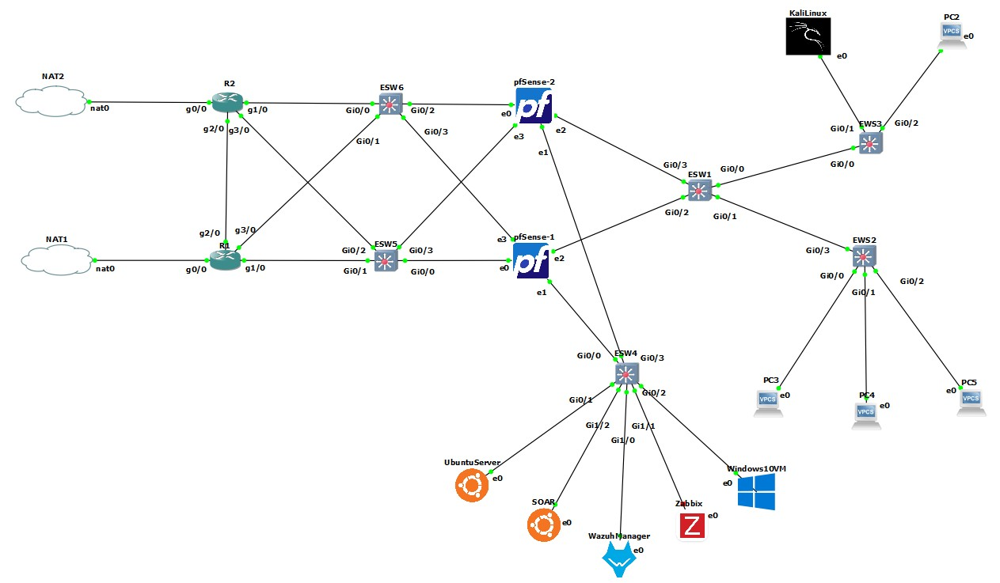

# 🧪 Tests de la Solution SOAR

Notre architecture est désormais en place, avec l’ensemble des outils correctement configurés et intégrés.  
Afin d’évaluer l’efficacité de la solution mise en œuvre, nous avons procédé à une série de tests visant à vérifier la détection, la remontée et le traitement des événements de sécurité dans divers scénarios.

---

## Scénario de test 1 : Attaque par force brute

Pour simuler une attaque par force brute, la machine **PC1** a été temporairement remplacée par une machine **Kali Linux**. Celle-ci a permis de réaliser des tests de pénétration ciblés dans un environnement contrôlé, en respectant la segmentation réseau de la maquette.  

La figure suivante illustre l’intégration de Kali Linux au sein de notre architecture réseau.

  
*Figure 1 : Intégration de la machine Kali Linux dans la maquette*

Après l’intégration de Kali Linux en tant que poste d’attaque au sein du **VLAN 10**, nous avons procédé à une simulation d’attaque par force brute ciblant le serveur **Ubuntu** placé dans le **VLAN 77**.  
Pour ce test, l’outil **Hydra** a été utilisé afin de tenter des connexions SSH en s’appuyant sur deux dictionnaires :  

- `users.txt` : liste d’identifiants  
- `passwords.txt` : liste de mots de passe  

  
*Figure 2 : Attaque par force brute*

Suite au lancement de l’attaque par force brute, une alerte a été immédiatement générée et reçue sur la plateforme **Wazuh**.  
Cette alerte détaille notamment :  

- l’adresse IP de la machine cible  
- l’adresse IP de la machine attaquante  
- le port réseau exploité lors de l’attaque  

  
*Figure 3 : Alerte Wazuh pour attaque par force brute*

Dès la détection de l’alerte par Wazuh, une alerte correspondante a été automatiquement créée dans **TheHive**.  

  
*Figure 4 : Alerte de l’attaque par force brute créée dans TheHive*

Une fois l’alerte transmise à TheHive, nous l’avons ouverte afin d’en analyser les éléments contextuels.  

  
*Figure 5 : Aperçu de l’alerte de force brute dans TheHive*

Le cas comporte les **observables** créés, où les résultats des analyseurs de Cortex sont accessibles.  

  
*Figure 6 : Observables de l’attaque par force brute*

L’analyseur **Cortex** a traité l’artefact et généré un **rapport d’analyse**, dont les résultats sont présentés ci-dessous.  

  
*Figure 7 : Rapport Cortex pour attaque par force brute*  

  
*Figure 8 : Rapport TheHive pour attaque par force brute*

---

## Scénario de test 2 : Fichier malveillant

Dans ce scénario, un fichier malveillant de type **Trojan** a été téléchargé sur la machine **Ubuntu Server** afin de tester l’efficacité de la solution.  
Ce test avait pour objectif de vérifier la capacité du système à détecter une menace réelle et à générer les alertes nécessaires pour initier une réponse appropriée.  

Pour initier ce scénario, le fichier malveillant a été téléchargé sur la machine Ubuntu Server du réseau de test.  

  
*Figure 9 : Téléchargement de fichier malveillant*

Une alerte a été immédiatement générée par **Wazuh** dans la section **File Integrity Monitoring**, signalant une modification non autorisée du système de fichiers.  
Cette alerte indiquait l’ajout d’un fichier malveillant de type Trojan sur la machine Ubuntu ciblée.  

  
*Figure 10 : Détection du fichier malveillant via Wazuh*

Cette vue détaillée met en évidence les informations critiques relatives à l’ajout du fichier malveillant.  

  
*Figure 11 : Rapport d’alerte Wazuh*

Suite à la détection par Wazuh, une alerte liée au fichier malveillant a été automatiquement générée dans **TheHive**.  

  
*Figure 12 : Déclenchement d’une alerte dans TheHive*

Dès la réception de l’alerte, nous avons ouvert le cas pour examiner les informations contextuelles.  

  
*Figure 13 : Vue détaillée de l’alerte dans TheHive*

L’analyse de l’artefact par **Cortex** a généré un **rapport détaillé**, dont les résultats sont illustrés ci-dessous.  

  
*Figure 14 : Rapport d’analyse Cortex*  

  
*Figure 15 : Suite du rapport d’analyse Cortex*

---

Ce document présente les résultats des tests effectués sur notre architecture **SOC**, confirmant l’efficacité de la solution et l’intégration réussie des outils pour une réponse automatisée et structurée aux incidents de sécurité.
